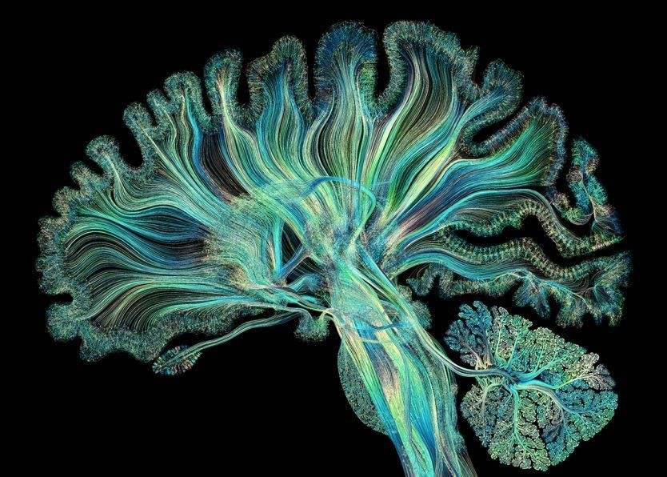
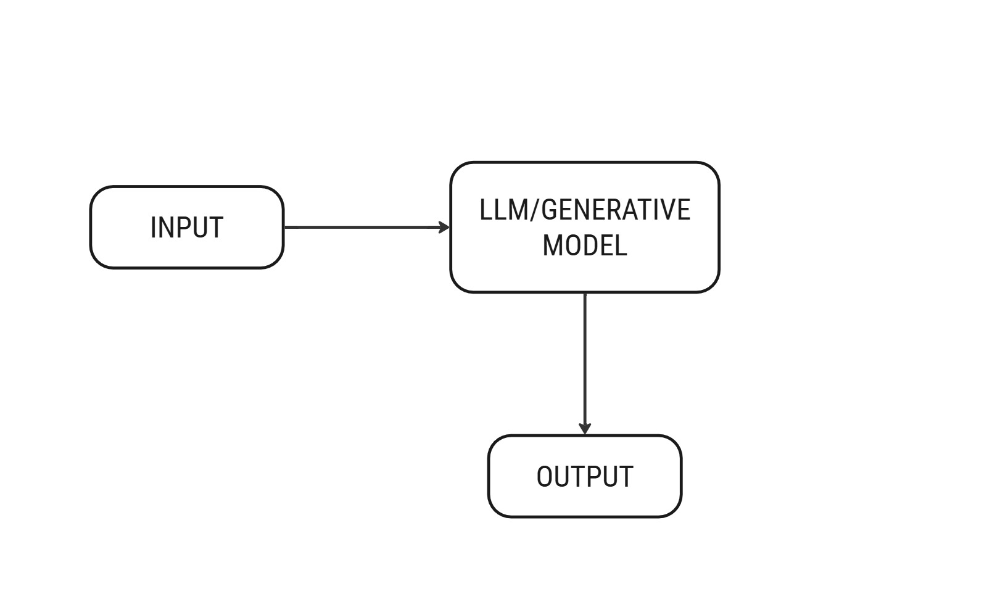
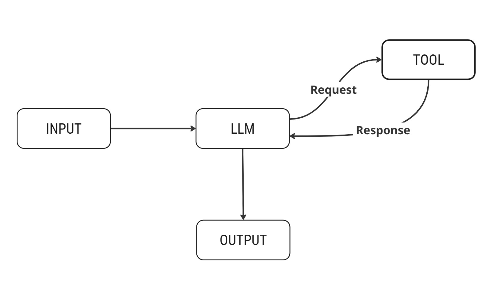
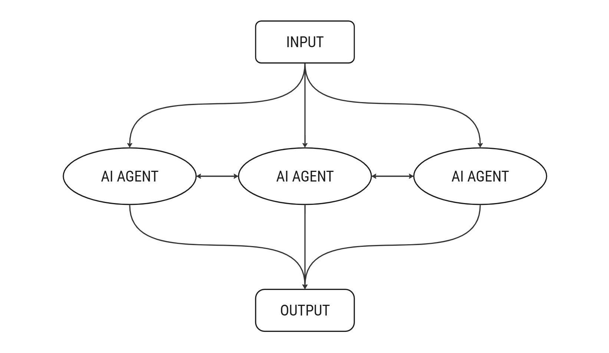

---

“Agentic AI basically means an AI that has agency,” said Jensen Huang, CEO of NVIDIA.  
At first, this might sound confusing. What does “agency” mean and how in the world is it related to Agentic AI?

If I were to put it in words, think of Agentic AI as a personal assistant. It can do separate tasks such as plan goals, make decisions, and take actions on its own. It can draft content while checking that it matches your brand voice. In short, Agentic AI takes initiative and manages tasks efficiently and safely, just like a highly capable assistant you can rely on to handle complex work without constant supervision.

---

---

## AI Landscape: Generative AI vs AI Agents vs Agentic AI

Generative AI is a type of AI that creates new content like writing text, generating images, or even generating audio and video. It works by learning from huge amounts of data and then responding to prompts(instructions) that you give it. The clearer and better your prompt, the better the output you get. Tools like ChatGPT or DALL·E are good examples of generative AI. While it is impressive, GenAI can only work with what it has learned during training and cannot access live or private information on its own.

AI Agents take things a step further. They can not only generate content but also act on their own by fetching real-time information from the internet or interacting with tools. For example, if you want the latest news, an AI agent will fetch it for you. Each agent focuses on one task at a time — making them more specialized and capable than basic GenAI.

Agentic AI takes this even further by coordinating with different AI agents to handle bigger, more complex tasks. Each agent works together, i.e., takes care of a part of the job and shares information with the other agents to achieve the result. Imagine turning a YouTube video into a blog post. One agent could create the transcript, another drafts a catchy title, a third write the description, and a fourth craft the conclusion. Human feedback can also be added to make sure everything is accurate. In short, Agentic AI is like an AI that has its own agency.

---

## Design Patterns of Agentic AI

Imagine that you are running a brand’s social media campaign. Here’s how Agentic AI works behind the scenes:

**1. Reflection:**  
After drafting a post, the AI rechecks its tone, grammar, and alignment with the brand’s voice.  
If the caption sounds too casual for a luxury brand, it rewrites it automatically — like a social media manager reviewing their own draft.

**2. Tool Usage:**  
Once the post is ready, another agent connects to the platform’s API (Instagram, Facebook, etc.) to see what kind of content is performing best this week.  
It finds carousel posts are trending and instantly suggests repurposing your static image.

**3. Planning and Task Decomposition:**  
Instead of one big “make a campaign” command, the system breaks the job into parts — one agent writes captions, another chooses hashtags, a third schedules posts.  
Each runs simultaneously, completing the task in minutes instead of hours.

**4. Multi-Agent Collaboration:**  
All agents cooperate — the content agent checks with the analytics agent to see what’s performing, while the tone-checker ensures consistency.  
If engagement drops, they adjust together like a marketing team.

**5. Outcome:**  
The result is a fully optimized, brand-consistent campaign that feels human, adapts quickly, and runs without chaos.

These design patterns combine to form a system that executes tasks **while understanding context, tone, and brand guidelines** — leading to fewer mistakes, faster turnaround, and human-like, audience-aligned content.

---

## Before & After: How Agentic AI Protects Your Brand

Think about how most businesses use AI today. A single LLM is given a prompt, which generates a response, and that output either goes straight to the customer or onto a public platform. While this approach is fast, it’s also too risky. Without any built-in checks, the AI most of the times sound too robotic, misses the emotional tone, and sometimes might even share information that doesn’t align with your brand’s values. We’ve all witnessed examples of automated responses that feels insensitive or frustrating during an issue you are facing, or a support message that completely misses the point of a customer’s concern something that even research has highlighted in [Regal.ai blog](https://www.regal.ai/blog/humans-get-frustrated-talking-to-ai). These moments can quietly damage trust and credibility, especially in the world of social media, where perception spreads fast.

Now imagine the same situation but with Agentic AI. Instead of one system doing everything, you have a network of agents which are specialized in individual tasks working together. One agent can plan the task, another can create the content, a third can check the tone and alignment with your brand voice, and a fourth ensures that the message meets compliance or ethical standards. And at the end of it all, a human will still be there to confirm everything, giving it that extra level of confidence and trust. The result not only is just faster output, but also, it’s safer and more thoughtful communication.

Agentic AI builds in layers of accountability. Before anything is published, the system has already reviewed and refined its work multiple times. It’s like having an internal review team that never rests, is constantly checking for accuracy, tone, and brand consistency. The best part? It still saves time and resources because the process happens automatically, at machine speed.

For businesses that live and breathe through their online presence, this becomes a game changer. Agentic AI allows you to maintain a strong, authentic brand voice while scaling content and engagement. It helps brands act fast without losing their human touch, and that’s what sets it apart from traditional AI.

---

## Business Results and ROI Impacts

Agentic AI is not only about smarter technology — it’s about **creating measurable business value**.

**1. Faster Campaign Turnaround**  
With multiple agents working in parallel, campaign production time drops by **40–60%**.  
What used to take a week can now be done in 2–3 days.

**2. Consistent Brand Voice and Compliance**  
Specialized agents for tone and review reduce off-brand content errors by **70%**, maintaining brand integrity.

**3. Improved Customer Experience**  
Multi-agent collaboration increases satisfaction scores by up to **3×** compared to single-agent responses.

**4. Data-Driven Decision Making**  
Automated analytics improve engagement by **20–35%** and campaign effectiveness by **15–25%**.

**5. Cost Efficiency and Scalability**  
Automation reduces operational costs by **30–40%**, enabling effortless scaling.

**6. Long-Term ROI and Competitive Edge**  
Brands report **2–3× faster project launches** and ROI growth of **25–50%** — sustaining a lasting competitive advantage.

---

## Risks

While Agentic AI offers crazy capabilities, it’s not without any potential risks. AI agents can sometimes produce outputs that are off-brand, inaccurate, or even misleading if left unchecked. The complexity of coordinating multiple agents also introduces operational challenges, and businesses need to be mindful of ethical considerations and compliance requirements. The good news is that Agentic AI comes with built-in guardrails. Reflection, planning, and multi-agent collaboration act as checks and balances, catching any present errors, verifying the tone and ensures the outputs align with brand voice and guidelines. By combining Agentic AI with human oversight, businesses can utilise the full potential of Agentic AI while minimizing the risks.

---

## Practical Roadmap for Marketers

Adopting Agentic AI doesn’t have to be an overwhelming task. The best approach to include Agentic Ai in your production/campaigns is by gradual adoption.

- Starting with an assistive phase, where the AI handles simple, repetitive tasks such as drafting content, generating ideas, or scheduling posts. This allows teams to be exposed to benefits while maintaining human control. 
- The next phase is semi-autonomous, where agents take on more complicated responsibilities like analyzing trends, optimizing content or managing campaigns, with humans supervising and refining outputs. 
- Finally, businesses can move toward being fully autonomous, where multiple agents coordinate entire workflows, executing campaigns across channels while humans focus on high-level strategy and creative direction.

The above approach ensures a smooth transition, risk mitigation, and maximum value from the technology.

---

## Outlook and Vision

The future of marketing with the help of Agentic AI is about partnership and not replacement. Marketing teams will collab with squads of digital agents, each of them handling specialized tasks, from content creation and analytics to community engagement and brand compliance. These agents will operate 24/7, constantly optimizing campaigns by studying recent trends in real time. As AI continues becoming more autonomous and sophisticated, businesses will be able to scale operations, personalize their engagement and maintain consistent brand messaging like never before. Agentic AI is certain to become a trusted and proactive partner, helping companies stay ahead in a rapidly evolving digital landscape.

---

## Conclusion

When Jensen Huang said, “Agentic AI basically means an AI that has agency,” it might have sounded abstract at first. Now, after seeing how Agentic AI works in practice by coordinating with multiple specialized agents, planning tasks, checking outputs, and protecting your brand’s voice and following its guidelines, it’s clear just how powerful it can be and how much of a transformation it brings. Agentic AI is more than a tool, it is an agency of agents that enables businesses to scale campaigns faster, maintain brand consistency, deliver richer customer experiences, and gain a real competitive advantage. In a world where speed, accuracy, and trust matter more than ever.

---

<h3> ✍️ Written By </h3>

  
  

    
Anish Chandurkar

    
AI Researcher | Competitive Programmer

  

